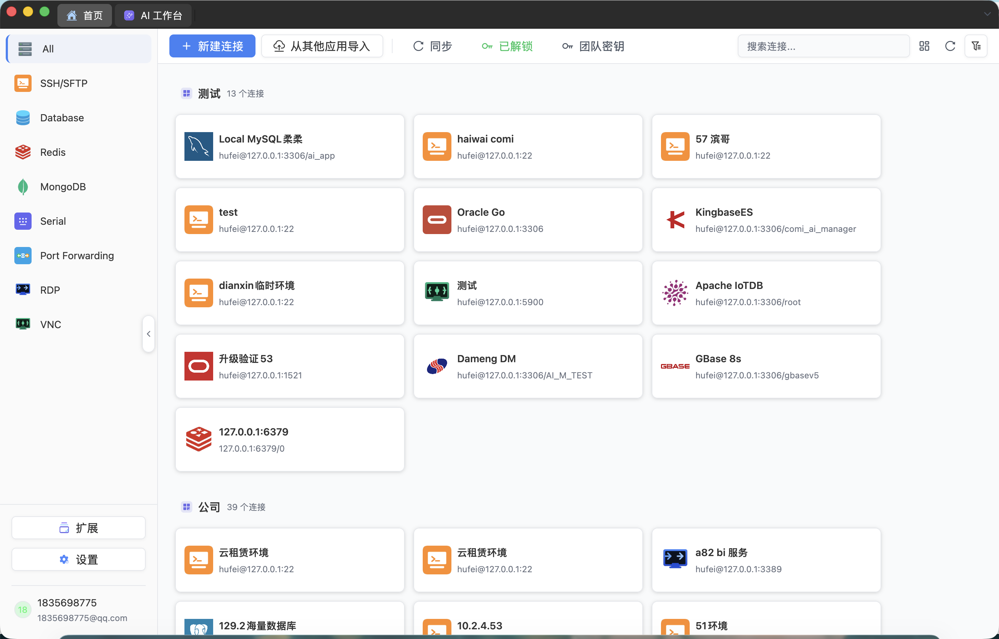
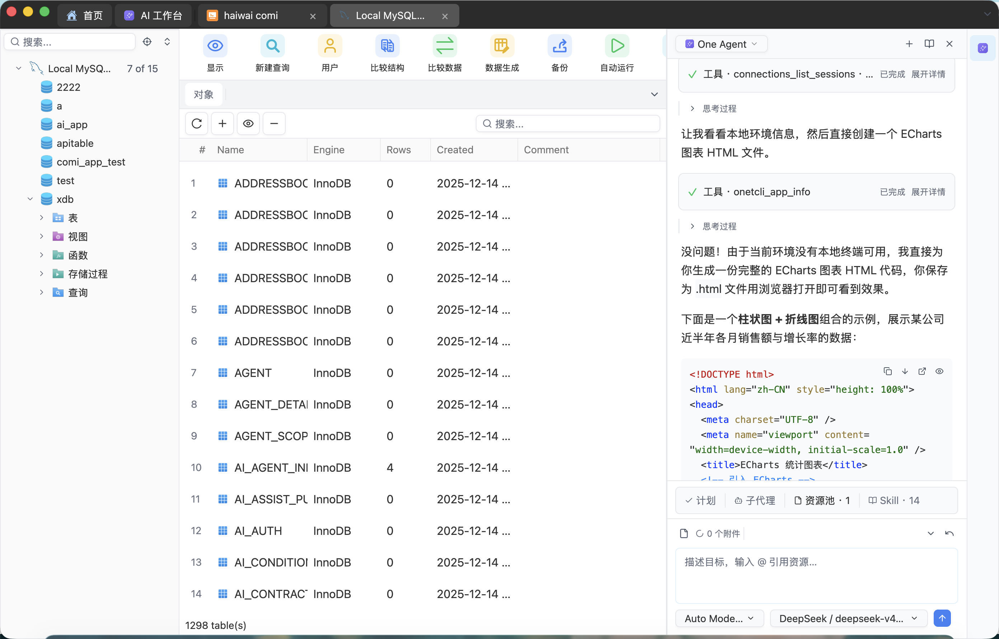
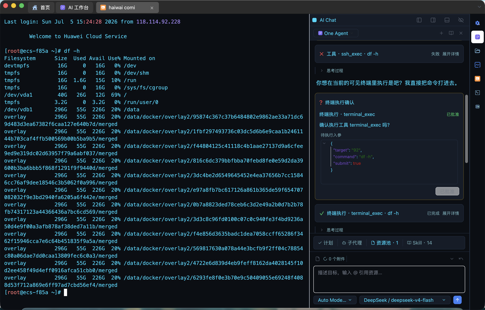
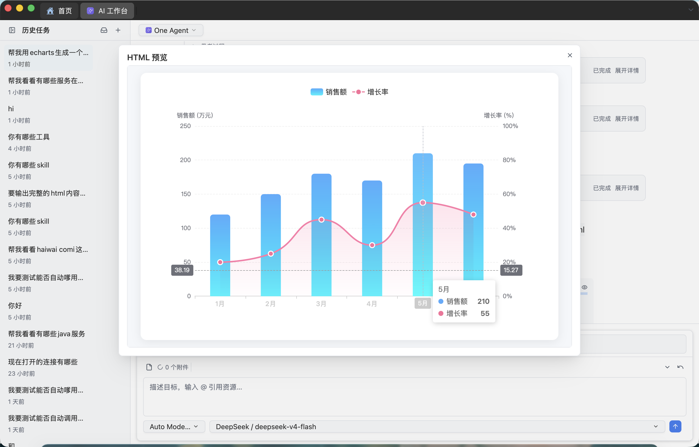
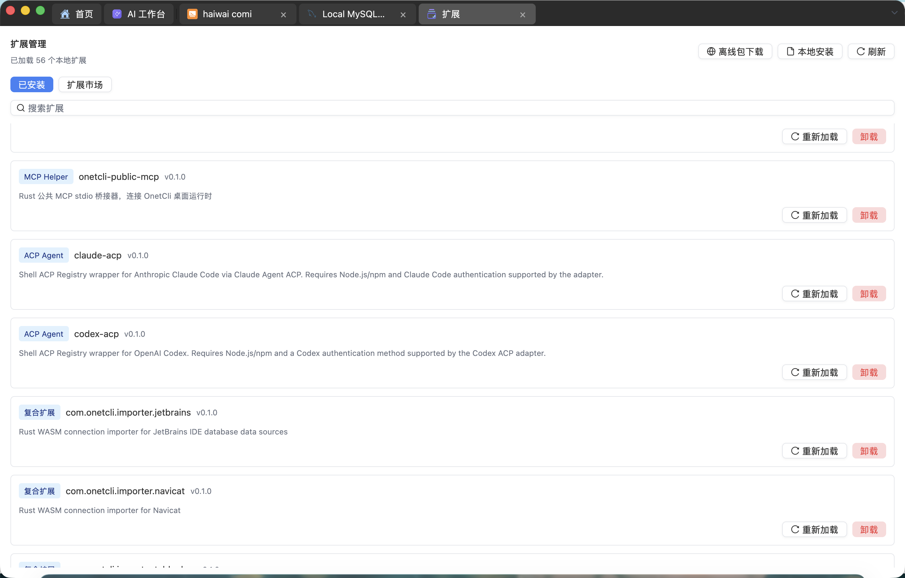

> [!IMPORTANT]
> ### 🚚 项目已迁移至 Navop
>
> **OnetCli 已停止更新，但本仓库暂不归档。**
>
> 仓库将继续保留历史代码和现有 Issues；OnetCli 后续不再提供新功能、问题修复或版本发布，相关问题将在新的 **Navop** 仓库中继续修复。
>
> 项目后续开发地址：
>
> - 官方网站：<https://navop.dev>
> - GitHub 仓库：<https://github.com/feigeCode/navop>

<div align="center">
  <p>
    
  </p>

  <h1>OnetCli</h1>

  <p><strong>数据库、SSH、SFTP、端口转发、终端、远程桌面、监控与 AI 一体化的原生桌面工作台。</strong></p>

  <p>
    基于 <a href="https://gpui.rs">GPUI</a> 构建 · Rust 原生桌面应用 · GPU 加速渲染
  </p>

  <p>
    <a href="https://github.com/feigeCode/onetcli/releases"></a>
    <a href="https://github.com/feigeCode/onetcli/actions/workflows/ci.yml"></a>
    <a href="LICENSE-APACHE"></a>
    <a href="https://qm.qq.com/cgi-bin/qm/qr?k=&group_code=860670605"></a>
    <a href="https://docs.qq.com/doc/DVEFFd2RnSnJLcFBD"></a>
  </p>

  <p>
    
    
    
    
    
    
    
    
    
    
    
    
    
    
    
    
    
    
    
    
  </p>

  <p>
    <a href="README.md">English</a> ·
    <a href="#安装">安装</a> ·
    <a href="https://github.com/feigeCode/onetcli/releases/latest">最新版本</a> ·
    <a href="#功能特性">功能特性</a> ·
    <a href="#应用截图">应用截图</a> ·
    <a href="CONTRIBUTING.md">参与贡献</a>
  </p>

  <p>
    
  </p>
</div>

## v0.8.0 更新亮点

- **AI Agent 与 Function Calling** — AI Agent 支持通过工具调用完成结构化任务，支持通过工具加载 skills，并优化资源池、资源 mention 和资源目录刷新体验。
- **HTML 预览流程** — HTML 代码块支持在浏览器中打开，也支持通过应用内弹窗进行渲染预览，避免在聊天内容中出现干扰阅读的内联预览。
- **数据库比较与同步** — 优化 schema/data compare 窗口、比较目标加载、多表同步和数据库比较同步稳定性。
- **终端效率提升** — 新增终端命令历史面板，支持 SSH 多窗口广播输入，并优化远程 shell integration 的安装、卸载和环境变量处理。
- **连接导入** — 新增从其他应用导入连接的入口，并优化首页侧边栏布局。
- **团队功能入口** — 新增团队管理入口，并通过功能开关控制展示范围。
- **扩展与语言包** — 新增 language bundle 扩展类型，支持检测和安装语言包。
- **渲染与字体修复** — 修复字体 fallback / 字体渲染导致的乱码问题，并优化渲染进程阻塞导致的连接列表、数据列表滚动卡顿。
- **设置与 UI 打磨** — API Key 输入框支持显示/隐藏切换，输入组件支持本地主题样式，窗口和选择组件布局适配进一步优化。


## 为什么选择 OnetCli？

<table>
  <tr>
    <td width="50%">
      <h3>原生桌面体验，而不是浏览器外壳</h3>
      <p>OnetCli 使用 Rust 和 GPUI 构建，提供原生桌面体验与 GPU 加速渲染。</p>
    </td>
    <td width="50%">
      <h3>日常运维集中到一个工作区</h3>
      <p>数据库管理、SSH 终端、SFTP 文件传输、端口转发、串口连接、本地终端以及远程桌面（RDP/VNC）都在同一个应用中完成。</p>
    </td>
  </tr>
  <tr>
    <td>
      <h3>AI 就在数据旁边</h3>
      <p>内置 AI 助手支持自然语言生成 SQL、查询解释、BI 数据分析和图表生成。</p>
    </td>
    <td>
      <h3>远程工作少切换上下文</h3>
      <p>打开远程终端，通过 SFTP 浏览文件，把文件拖进侧边栏上传，并直接编辑带语法高亮的远程文件。</p>
    </td>
  </tr>
</table>

## 功能特性

### 数据库工作区

在同一界面连接 MySQL、PostgreSQL、SQLite、DuckDB、SQL Server、Oracle 和 ClickHouse。网络数据库连接支持每连接 SOCKS5 / HTTP CONNECT 代理、代理认证，以及“通过代理连接 SSH 再建立数据库隧道”。可浏览数据库、Schema、表、字段、索引、外键、过程、函数、触发器和序列等对象，具体能力取决于数据库类型。

在内置驱动之外，OnetCli 还提供扩展市场，可按需安装达梦 DM、金仓 KingbaseES、南大通用 GBase 8s、OceanBase、openGauss、Apache IoTDB 的数据库驱动，以及一个无需 Oracle Instant Client 的纯 Go Oracle 驱动。安装后会与内置数据库一同出现在连接列表中。

### SQL 编辑器与 Schema 工具

提供 SQL 编辑、语法相关能力、Schema 浏览、表结构编辑、查询执行、Explain 支持与 ER 图等数据库工作流。数据库比较工具支持 schema/data 比较、目标选择、同步计划和多表同步流程。

### Redis 与 MongoDB

专用 Redis 视图支持键浏览、值查看与集群连接。MongoDB 视图支持集合浏览、文档查看与查询。

### SSH、SFTP、端口转发、串口与终端

集成 SSH 会话、SFTP 文件管理、端口转发、串口连接和本地终端，支持多标签页同时操作。本地终端可选择系统默认、PowerShell、CMD、WSL、Git Bash，或配置自定义程序与安全解析的启动参数。终端还支持命令历史、SSH 多窗口广播输入、远程 shell integration 管理，并内置 SFTP 侧边栏，可直接拖拽上传文件，也支持 SFTP 路径收藏和常用目录快速跳转。

### 端口转发

基于已有 SSH/SFTP 服务器创建可复用的 SSH 端口转发连接。OnetCli 支持用于数据库、内部 HTTP 服务等场景的本地端口转发，也支持动态 SOCKS 隧道，方便把本地工具流量经远程主机转发。

### 远程文件编辑

可直接在 OnetCli 内编辑远程文件，支持语法高亮和自动补全。无需额外打开其他编辑器，也无需在终端和文件工具之间来回切换。

### 远程桌面（RDP 与 VNC）

通过可安装的远程桌面 provider 打开 RDP 和 VNC 会话。每个连接都可使用 SOCKS5 或 HTTP CONNECT 代理，无需升级 provider 协议。可经 RDP 连接 Windows 机器，或连接任意 VNC 服务端，在数据库、终端和文件所在的同一个工作台里直接操作远程桌面。

### 监控与图表

内置简易服务器监控和原生渲染图表，可查看远程机器状态，也可用于数据分析结果展示。

### AI 助手

应用内直接与 AI 对话，支持自然语言生成 SQL、查询解释、BI 数据分析、图表生成、流式 LLM 响应、AI Agent 工作流，以及通过 Function Calling 调用工具完成任务。HTML 代码块可在浏览器中打开，也可通过应用内弹窗预览；AI 生成的终端命令可快速粘贴到终端会话中执行。

### 性能与渲染

OnetCli 基于 GPUI 原生渲染，并持续优化高负载 UI 路径。近期已修复字体 fallback / 字体渲染导致的乱码问题，并优化渲染进程阻塞导致的连接列表、数据列表滚动卡顿。

### 同步、安全与国际化

支持跨设备同步连接和设置，密钥使用 AES-GCM 与 Ed25519 加密存储。支持亮色 / 暗色主题，以及 English、简体中文、繁体中文。

## 应用截图

| 数据库 | SSH |
|:-:|:-:|
| [](database.png) | [](ssh.png) |

| SFTP | Redis |
|:-:|:-:|
| [](sftp.png) | [](redis.png) |

| MongoDB | AI 对话 |
|:-:|:-:|
| [](mongodb.png) | [](chatdb.png) |

| 服务器监控 | SFTP 侧边栏 |
|:-:|:-:|
| [](monitor.png) | [](sftp_sidebar.png) |

| 远程文件编辑 | ER 图 |
|:-:|:-:|
| [](remote_file_editor.png) | [](er.png) |

| 扩展市场 |
|:-:|
| [](extension.png) |

## 安装

> OnetCli 下载内容仅作为历史版本保留。新用户请使用仍在持续维护的后续项目 [Navop](https://navop.dev)。

请从 [Releases](https://github.com/feigeCode/onetcli/releases/latest) 页面下载最新版本。

当前发布产物按平台提供：

| 平台 | 架构 | 产物 |
|------|------|------|
| macOS | Apple Silicon、Intel | `.dmg`、`.tar.gz` |
| Linux | x86_64 | `.tar.gz` |
| Windows | x86_64 | `.zip` |

每个版本会同时发布 `sha256sums.txt` 校验文件。

### macOS Gatekeeper

如果 macOS 安装 DMG 后提示无法打开（"Apple 无法检查其是否包含恶意软件"），请执行：

```bash
sudo xattr -rd com.apple.quarantine /Applications/OnetCli.app
```

### Oracle 支持

内置 Oracle 驱动需要安装 [Oracle Instant Client](https://www.oracle.com/database/technologies/instant-client/downloads.html)（Basic 包），请下载与平台匹配的版本并确保库文件位于系统库搜索路径中。如果不想依赖 Instant Client，可从扩展市场安装纯 Go 版 Oracle 驱动。

## 快速开始

1. 打开 OnetCli，创建第一个数据库连接。
2. 添加 SSH 主机并打开远程终端。
3. 基于该 SSH 主机创建端口转发连接，用于本地隧道或 SOCKS 代理。
4. 打开 SFTP 文件管理，浏览远程目录或传输文件。
5. 尝试 Redis Key 浏览或 MongoDB 文档浏览。
6. 在 SQL 或数据分析工作流中使用 AI 助手。

## 从源码构建

### 前置条件

- Rust 2024 edition
- 各平台系统依赖

### 系统依赖

**macOS / Linux：**

```bash
./script/bootstrap
```

**Windows（PowerShell）：**

```powershell
.\script\install-window.ps1
```

### 运行

```bash
cargo run -p main
```

### 开发检查

```bash
# 构建
cargo build

# 测试
cargo test --all

# Lint
cargo clippy --workspace --all-targets

# 格式检查
cargo fmt --check
```

完整开发指南请参阅 [CONTRIBUTING.md](CONTRIBUTING.md)。

## 技术栈

| 类别 | 技术 |
|------|------|
| UI 框架 | [GPUI](https://gpui.rs) |
| 编程语言 | Rust |
| 数据库驱动 | tokio-postgres, mysql_async, rusqlite, tiberius, oracle, clickhouse, duckdb |
| 数据库扩展 | 达梦 DM、金仓 KingbaseES、GBase 8s、OceanBase、openGauss、Apache IoTDB、纯 Go Oracle |
| Redis / MongoDB | redis, mongodb |
| SSH / SFTP / 端口转发 | russh, russh-sftp, 基于 SSH direct-tcpip 的 SOCKS5 |
| 远程桌面 | 经扩展运行时加载的 RDP / VNC provider |
| 终端仿真 | alacritty_terminal |
| 文本编辑 | ropey, tree-sitter, sqlparser |
| AI | llm-connector |
| 加密 | aes-gcm, sha2, ed25519 |
| 国际化 | rust-i18n |

## 常见问题

<details>
<summary><strong>支持哪些数据库？</strong></summary>

OnetCli 内置支持 MySQL、PostgreSQL、SQLite、DuckDB、SQL Server、Oracle 和 ClickHouse，同时包含专用 Redis 与 MongoDB 视图。扩展市场还提供达梦 DM、金仓 KingbaseES、GBase 8s、OceanBase、openGauss、Apache IoTDB 以及纯 Go Oracle 驱动，让国产和特色数据库也能纳入同一个工作台。
</details>

<details>
<summary><strong>Oracle 是否需要额外配置？</strong></summary>

内置 Oracle 驱动需要 Oracle Instant Client，且库文件需位于系统库搜索路径中。你也可以从扩展市场安装纯 Go 版 Oracle 驱动，无需依赖 Instant Client。
</details>

<details>
<summary><strong>在哪里下载 OnetCli？</strong></summary>

请使用 GitHub [Releases](https://github.com/feigeCode/onetcli/releases/latest) 页面。当前发布流程会生成 macOS、Linux、Windows 平台产物，并附带校验文件。
</details>

<details>
<summary><strong>OnetCli 是免费的吗？</strong></summary>

所有功能不依赖赞助解锁。源码基于 Apache License 2.0 开源，分发和产品化使用还需要遵守 OnetCli 补充协议。
</details>

<details>
<summary><strong>如何反馈 Bug 或提出功能建议？</strong></summary>

请在 [GitHub Issues](https://github.com/feigeCode/onetcli/issues) 提交。若要贡献代码，请先阅读 [CONTRIBUTING.md](CONTRIBUTING.md)。
</details>

## 支持

OnetCli 由个人长期维护。如果它节省了你的时间，可以通过捐赠、Star、提交 Bug 或贡献聚焦的小型 PR 支持项目。

### 捐赠

捐赠完全自愿，不会解锁或限制任何功能。微信支付、支付宝和 PayPal 捐赠方式请查看 [DONATE_CN.md](DONATE_CN.md)。

### 社区联系

官方社区入口：

- QQ 群：[860670605](https://qm.qq.com/cgi-bin/qm/qr?k=&group_code=860670605)
- 微信群：[加入](https://docs.qq.com/doc/DVEFFd2RnSnJLcFBD)

## 致谢

ER 图渲染基于 [ferrum-flow](https://github.com/tu6ge/ferrum-flow.git)。

## 许可证

本项目基于 [Apache License 2.0](LICENSE-APACHE) 开源。

OnetCli 应用的分发与使用须同时遵守 [OnetCli 补充协议](ONETCLI_LICENSE)，该补充协议在 Apache 2.0 基础上增加以下限制：

- 禁止二次分发、转售或将本软件作为独立产品再分发
- 禁止基于本软件代码创建竞争性产品或服务
- 禁止将本软件托管于未经授权的分发平台

如有许可证与版权相关问题，请联系 xiaofei.hf@gmail.com。

## Star History

<a href="https://star-history.dera.page/#feigeCode/onetcli&type=date&logscale=&legend=top-left">
 <picture>
   <source media="(prefers-color-scheme: dark)" srcset="https://star-history.dera.page/svg?repos=feigeCode/onetcli&type=date&theme=dark&logscale&legend=top-left" />
   <source media="(prefers-color-scheme: light)" srcset="https://star-history.dera.page/svg?repos=feigeCode/onetcli&type=date&logscale&legend=top-left" />
   
 </picture>
</a>
